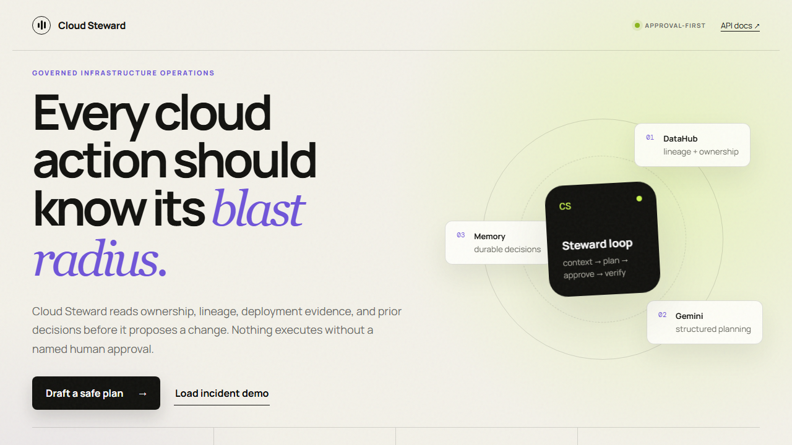
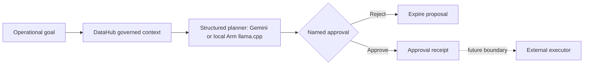

# Cloud Steward

[](https://github.com/Layerrail/cloud-steward/actions/workflows/ci.yml)

**Infrastructure decisions with receipts.** Cloud Steward turns governed metadata into reversible, approval-first action plans for small teams that cannot staff a full platform organization.

Cloud Steward is a new standalone project started on **2026-08-02**. It is not a relabeling of LayerRail and does not copy or relicense LayerRail's AGPL source. A future LayerRail connector will use documented network APIs.

**[Open the live demo](https://cloud-steward.onrender.com)** · **[Watch the live DataHub MCP walkthrough](https://youtu.be/xW0RnBrROeA)**



## Why it exists

Cloud incidents rarely fail because a team cannot run a command. They fail because the operator does not have enough context:

- Who owns the resource?
- Which data products and customers depend on it?
- Which revision is deployed?
- What happened the last time this change was attempted?
- Who approved the risk and what is the rollback?

Cloud Steward makes those questions part of the action path.

## Current capabilities

- Collect governed metadata through the open-source **DataHub MCP Server**.
- Generate schema-constrained plans with **Gemini**.
- Run schema-constrained local planning through CPU-only **llama.cpp**, including an Arm KleidiAI path.
- Persist context, plans, and named approvals in **CockroachDB** or local SQLite.
- Recall related decisions through a CockroachDB `VECTOR(8)` cosine index, with a disclosed deterministic local fallback.
- Explain the target, reason, expected outcome, verification, rollback, and risk of every action.
- Default to dry-run and expose **no execution endpoint**.
- Run as a multi-architecture container, including Linux/Arm64.
- Provide a public demo mode with realistic sample metadata when integrations are not configured.

## Verified evidence

[CI run 30781828308](https://github.com/Layerrail/cloud-steward/actions/runs/30781828308) passed on 2026-08-03 with:

- Python 3.12 and 3.13 lint and test jobs;
- a native GitHub-hosted Arm64 container build and 1,000-iteration benchmark on `aarch64` (0.0105 ms median, 0.0108 ms p95 for deterministic plan generation);
- a secure CockroachDB Compose run that creates a plan, searches decision memory, and verifies `steward_memory_embedding_idx`; and
- live Gemini schema-constrained planning through a masked repository secret.

These isolated workflows prove the integration paths; they do not change the public Render demo's disclosed sample/deterministic/local modes.

On 2026-08-03, a separate local evidence run used DataHub Core v1.5.0.6,
the official `showcase-ecommerce` datapack, and open-source DataHub MCP tools
`search`, `get_entities`, and `get_lineage`. The captured result contains eight
governed resources, named ownership, glossary and structured-property context,
health signals, and one-hop upstream/downstream lineage. See
[`docs/evidence/datahub-context.json`](docs/evidence/datahub-context.json) and
its SHA-256 sidecar and the
[104-second live integration walkthrough](https://youtu.be/xW0RnBrROeA). This
local proof does not imply the public Render service is configured with DataHub.

## Safety model



Approval records intent; it does not run infrastructure. Execution is intentionally outside this repository's current boundary.

## Run locally

Requirements: Python 3.12+.

1. Create and activate a virtual environment.
2. Install the package and development dependencies: `pip install -e ".[dev]"`.
3. Copy `.env.example` to `.env` and configure only the integrations you want.
4. Start the server: `uvicorn cloud_steward.main:app --reload --port 8080`.
5. Open `http://localhost:8080`.

Without external credentials, the app runs in a fully disclosed demo mode with deterministic planning, sample DataHub context, and local SQLite memory.

## Reproduce the demo assets

Install development dependencies and Playwright's recording codec, then run `python scripts/record_demo.py`. The script records the public deployment with the installed Microsoft Edge browser and writes screenshots under `docs/images/`; generated video artifacts remain gitignored.

## Run with CockroachDB

The Compose stack starts a single-node CockroachDB instance and Cloud Steward:

1. Copy `.env.example` to `.env`.
2. Run `docker compose up --build`.
3. Open `http://localhost:8088`; the CockroachDB console is at `http://localhost:8089`.

For CockroachDB Cloud, set `DATABASE_URL` to the provided PostgreSQL-compatible connection URL. Never commit it.

## Connect DataHub MCP

### Managed DataHub Cloud

Set `DATAHUB_MCP_URL` to the tenant MCP endpoint and `DATAHUB_GMS_TOKEN` to a scoped service-account token.

### Self-hosted DataHub Core

Install the DataHub extra with `pip install -e ".[datahub]"`, configure `DATAHUB_GMS_URL` and an optional `DATAHUB_GMS_TOKEN`, and leave `DATAHUB_MCP_URL` empty. Cloud Steward launches the open-source `mcp-server-datahub` module in the same Python environment, discovers its available tools, searches the catalog, retrieves entity governance, and collects one-hop upstream and downstream lineage.

The app explicitly disables DataHub mutation, user, and document tools for this context path.

With DataHub Core running and populated, execute `python scripts/capture_datahub_evidence.py`. The script requires a live `datahub-mcp` response; verifies `search`, `get_entities`, and `get_lineage` plus governance and lineage results; rejects credential-like content; and writes the governed context snapshot to `docs/evidence/datahub-context.json`.

A complete local evidence sequence is:

1. Start the official development stack with `datahub docker quickstart`.
2. Configure its CLI with `datahub init --username datahub --password datahub`.
3. Load the official rich lineage sample with `datahub datapack load showcase-ecommerce`.
  On Windows, use `python scripts/load_datahub_showcase.py --no-cache`; DataHub CLI
  1.6.0.17 otherwise interprets the `C:` drive prefix as an unregistered URL scheme.
4. Set `DATAHUB_GMS_URL=http://127.0.0.1:8080` in the Cloud Steward process.
5. Run the evidence script and inspect the resulting ownership, tags, and lineage before publishing it.

The DataHub quickstart uses development credentials and host-bound backend ports; it is not a production deployment.

## Connect Gemini

Set `GEMINI_API_KEY`. Cloud Steward uses the official `google-genai` SDK and requests structured output matching the `ActionPlan` schema. Model output remains a proposal and is never treated as authority to execute.

On Google Cloud Run, set `GOOGLE_GENAI_USE_VERTEXAI=true`, `GOOGLE_CLOUD_PROJECT`, and `GOOGLE_CLOUD_LOCATION`. The official SDK then uses the Cloud Run service account through Application Default Credentials, so no Gemini API key is stored in the container.

## Run local inference on Arm64

Set `LLAMA_CPP_BINARY` to a CPU-only `llama-cli` executable and `LLAMA_CPP_MODEL_PATH` to a compatible local GGUF instruction model. Local planning then takes precedence over Gemini, uses a strict JSON schema and deterministic sampling, and is validated through the same approval-first guardrails. No model or `llama.cpp` binary is bundled in this repository.

The dedicated native Arm64 workflow compares Qwen2.5-0.5B-Instruct FP16, Q4_0, and Q4_0 with Arm KleidiAI. It records prompt and generation throughput, peak RSS, model size, activation evidence, exact upstream revisions, checksums, and safety-quality parity. See [`docs/arm-inference.md`](docs/arm-inference.md) for the controlled method and reproduction steps.

## API

- `GET /api/status` — runtime and integration modes without secret values.
- `POST /api/plans` — collect context and create a proposed plan.
- `GET /api/plans` — list durable decision records.
- `GET /api/memory/search?query=...` — retrieve semantically related prior decisions.
- `POST /api/plans/{id}/approve` — record named approval only.
- `GET /healthz` — health probe.
- `GET /docs` — OpenAPI UI.

Example request body:

```json
{
  "goal": "Reduce checkout latency without breaking invoice generation",
  "context_query": "checkout billing invoice production",
  "environment": "production",
  "dry_run": true
}
```

## Hackathon integration plan

This repository is the shared, newly created base for separate submissions. Each submission will disclose the common base and identify the work added for that event.

- **DataHub Agent Hackathon:** governed metadata, lineage, ownership, and MCP context.
- **Arm AI Optimization:** Arm64 image, benchmark evidence, and inference/runtime optimization.
- **Gemini XPRIZE:** Gemini planning, Google Cloud deployment, users, costs, and small-business workflow.
- **CockroachDB × AWS:** persistent agent memory, vector retrieval, CockroachDB tools, and AWS deployment.
- **CALL-E:** consent-safe incident escalation and outcome recording.
- **RevenueCat Shipaton:** optional first-release Android companion after the core submissions.

## Repository structure

```text
src/cloud_steward/       application and provider adapters
src/cloud_steward/static modern browser dashboard
tests/                   safety, persistence, and API tests
deploy/                  cloud and Arm64 deployment evidence
submissions/             competition-specific disclosures and checklists
```

## License

Apache License 2.0. See `NOTICE` for provenance and separation from LayerRail.
