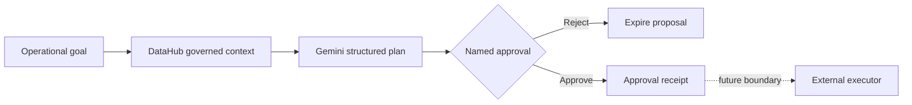

# Cloud Steward

**Infrastructure decisions with receipts.** Cloud Steward turns governed metadata into reversible, approval-first action plans for small teams that cannot staff a full platform organization.

Cloud Steward is a new standalone project started on **2026-08-02**. It is not a relabeling of LayerRail and does not copy or relicense LayerRail's AGPL source. A future LayerRail connector will use documented network APIs.

## Why it exists

Cloud incidents rarely fail because a team cannot run a command. They fail because the operator does not have enough context:

- Who owns the resource?
- Which data products and customers depend on it?
- Which revision is deployed?
- What happened the last time this change was attempted?
- Who approved the risk and what is the rollback?

Cloud Steward makes those questions part of the action path.

## Current capabilities

- Collect governed metadata through the open-source **DataHub MCP Server**.
- Generate schema-constrained plans with **Gemini**.
- Persist context, plans, and named approvals in **CockroachDB/PostgreSQL** or local SQLite.
- Explain the target, reason, expected outcome, verification, rollback, and risk of every action.
- Default to dry-run and expose **no execution endpoint**.
- Run as a multi-architecture container, including Linux/Arm64.
- Provide a public demo mode with realistic sample metadata when integrations are not configured.

## Safety model



Approval records intent; it does not run infrastructure. Execution is intentionally outside this repository's current boundary.

## Run locally

Requirements: Python 3.12+.

1. Create and activate a virtual environment.
2. Install the package and development dependencies: `pip install -e ".[dev]"`.
3. Copy `.env.example` to `.env` and configure only the integrations you want.
4. Start the server: `uvicorn cloud_steward.main:app --reload --port 8080`.
5. Open `http://localhost:8080`.

Without external credentials, the app runs in a fully disclosed demo mode with deterministic planning, sample DataHub context, and local SQLite memory.

## Run with CockroachDB

The Compose stack starts a single-node CockroachDB instance and Cloud Steward:

1. Copy `.env.example` to `.env`.
2. Run `docker compose up --build`.
3. Open `http://localhost:8088`; the CockroachDB console is at `http://localhost:8089`.

For CockroachDB Cloud, set `DATABASE_URL` to the provided PostgreSQL-compatible connection URL. Never commit it.

## Connect DataHub MCP

### Managed DataHub Cloud

Set `DATAHUB_MCP_URL` to the tenant MCP endpoint and `DATAHUB_GMS_TOKEN` to a scoped service-account token.

### Self-hosted DataHub Core

Install `uv`, configure `DATAHUB_GMS_URL` and an optional `DATAHUB_GMS_TOKEN`, and leave `DATAHUB_MCP_URL` empty. Cloud Steward launches the open-source `mcp-server-datahub` process through `uvx`, discovers its available tools, and selects a read-only search tool.

The app does not enable DataHub mutation tools.

## Connect Gemini

Set `GEMINI_API_KEY`. Cloud Steward uses the official `google-genai` SDK and requests structured output matching the `ActionPlan` schema. Model output remains a proposal and is never treated as authority to execute.

On Google Cloud Run, set `GOOGLE_GENAI_USE_VERTEXAI=true`, `GOOGLE_CLOUD_PROJECT`, and `GOOGLE_CLOUD_LOCATION`. The official SDK then uses the Cloud Run service account through Application Default Credentials, so no Gemini API key is stored in the container.

## API

- `GET /api/status` — runtime and integration modes without secret values.
- `POST /api/plans` — collect context and create a proposed plan.
- `GET /api/plans` — list durable decision records.
- `POST /api/plans/{id}/approve` — record named approval only.
- `GET /healthz` — health probe.
- `GET /docs` — OpenAPI UI.

Example request body:

```json
{
  "goal": "Reduce checkout latency without breaking invoice generation",
  "context_query": "checkout billing invoice production",
  "environment": "production",
  "dry_run": true
}
```

## Hackathon integration plan

This repository is the shared, newly created base for separate submissions. Each submission will disclose the common base and identify the work added for that event.

- **DataHub Agent Hackathon:** governed metadata, lineage, ownership, and MCP context.
- **Arm AI Optimization:** Arm64 image, benchmark evidence, and inference/runtime optimization.
- **Gemini XPRIZE:** Gemini planning, Google Cloud deployment, users, costs, and small-business workflow.
- **CockroachDB × AWS:** persistent agent memory, vector retrieval, CockroachDB tools, and AWS deployment.
- **CALL-E:** consent-safe incident escalation and outcome recording.
- **RevenueCat Shipaton:** optional first-release Android companion after the core submissions.

## Repository structure

```text
src/cloud_steward/       application and provider adapters
src/cloud_steward/static modern browser dashboard
tests/                   safety, persistence, and API tests
deploy/                  cloud and Arm64 deployment evidence
submissions/             competition-specific disclosures and checklists
```

## License

Apache License 2.0. See `NOTICE` for provenance and separation from LayerRail.
